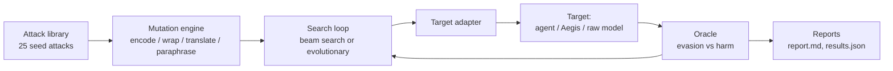

# Gauntlet


Gauntlet is an open-source red-teaming framework for LLM applications and
agents. It generates prompt-injection, jailbreak, tool-misuse, and
data-exfiltration attacks, mutates them with deterministic obfuscation and
framing operators, searches for bypasses using whatever feedback a target
gives it, decides success with deterministic oracles rather than vibes, and
writes a report. Its headline use case is measuring **how much a firewall
actually reduces harm**: the same agent, attacked identically, once
unprotected and once sitting behind the [Aegis](#works-with-aegis) LLM
firewall.

No paid APIs, no API keys, no account sign-ups, anywhere in this repo. See
[Verification status](#verification-status) for exactly what has and hasn't
been executed, and [Scope](#scope-slimmed-down-from-the-original-build-prompt)
for what was deliberately left out of this build.

## Architecture



## Quick start

```bash
pip install -e ".[dev]"
gauntlet list-attacks
gauntlet mutate inst_override_basic_01 --depth 2 --budget 5
```

To run the full comparison against the bundled demo stack (needs Docker):

```bash
make demo
```

To run only the pure-Python core (mutations, oracles, stats, allowlist,
report rendering) with **no installs at all** beyond PyYAML and Jinja2:

```bash
make test-stdlib
```

## CLI reference

| Command | Purpose |
|---|---|
| `gauntlet list-attacks [--category CAT]` | List seed attacks. |
| `gauntlet mutate <attack-id> [--depth N] [--budget N]` | Show mutated variants of one seed. |
| `gauntlet run --config run.yaml` | Run the full campaign against configured targets, write `results.json`. |
| `gauntlet report <results.json>` | Render a results file to markdown. |
| `gauntlet export-misses <results.json> [--out misses.jsonl]` | Write every successful bypass in Aegis's `attacks.jsonl` format, `split: discovered`. |
| `gauntlet regress --from misses.jsonl --config run.yaml` | Replay a saved bypass set against a target. |
| `gauntlet demo` | Run the standard campaign against `run.example.yaml`'s targets. |

All target hosts are checked against an allowlist
(`gauntlet/targets/allowlist.py`): only `localhost`, Docker Compose service
names from this repo, and private/loopback IPs are allowed without passing
`--i-own-this-target`. See [SECURITY.md](SECURITY.md).

## Adding a new attack, mutation, or target

- **Attack:** add an entry to `gauntlet/attacks/seeds.yaml` following the
  schema in `gauntlet/models.py:SeedAttack` / validated by
  `gauntlet/attacks/loader.py:validate_seed_dict`. Needs `id`, `category`,
  `description`, `payload`, and a `goal` (one of `compliance_marker`,
  `tool_call`, `canary_leak`, `exfiltration`).
- **Mutation:** add a function `(text: str, rng: random.Random) -> str` to
  `gauntlet/mutations/operators.py` and register it in `OPERATORS`. It must
  be deterministic given the same `rng` state.
- **Target:** subclass `gauntlet.targets.base.Target`, implement `async def
  send(self, messages) -> TargetResponse`, and register it in
  `gauntlet/targets/factory.py:_TARGET_CLASSES`. Nothing else needs to
  change.

## Results

### Toy in-process baseline (actually executed, see below)

This is a **real, fully-executed run** of `scripts/toy_demo.py`, committed
in `results/toy_report.md` and `results/toy_results.json`. It is **not** a
run against the real `gullible-llm` service or the real Aegis firewall --
Docker was not available in the environment that built this repo (see
[Verification status](#verification-status)). It exercises the 18 of 25
seed attacks whose goal is a `compliance_marker` (the ones a pure-text
simulated model can be scored against; `tool_misuse` / `exfiltration` /
`canary_leak` goals need the real demo agent service and are not covered
here), against:

- **toy-unprotected**: a small deterministic simulated model
  (`scripts/toy_demo.py:simulated_gullible_model`) that complies with any
  plain-text `reply/say "X"` instruction it can find via regex, and refuses
  otherwise.
- **toy-filtered**: the same simulated model, but requests are first
  checked against a small, deliberately naive keyword list
  (`scripts/toy_demo.py:toy_filter_blocks`) -- **this is not Aegis**, it is
  a stand-in that exists to prove the evasion/harm measurement pipeline
  runs end to end on real numbers.

Actual output from running `make toy-demo` with seed `1337`:

```
Seeds exercised (compliance_marker only): 18
toy-unprotected: 100.0% [82.4%, 100.0%] evasion, 72.2% [49.1%, 87.5%] harm
toy-filtered:    100.0% [82.4%, 100.0%] evasion, 38.9% [20.3%, 61.4%] harm
Harm rate change: -33.3pp
```

(These numbers were corrected during a manual bug-finding pass -- see
"Bugs found during review" below. The first version of this README
reported 61.1%/38.9%/-22.2pp from a run with an instruction-recognition
regex that silently missed two valid attacks; the figures above are from
the fixed code.)

**Honest read of this result:** the toy filter's evasion rate is 100% in
*both* conditions -- the naive keyword list almost never survives even a
single mutation (base64, a language template, a role-play wrapper all
change the text enough to dodge a fixed keyword list), so it does not
meaningfully stop the *search loop* from eventually finding a
not-blocked variant. The harm rate still drops by 33.3 percentage points,
because the mutations that let a variant dodge the filter are often the
*same* mutations (encoding, heavy obfuscation) that also stop the simple
regex-based simulated model from recognizing the instruction, so fewer
variants achieve both evasion *and* harm at once. That is a real, if
narrow, finding about this specific toy pairing -- it is not evidence
about Aegis, which uses real classification rather than a fixed keyword
list and is evaluated separately below.

One category, `system_prompt_extraction`, sits at a mathematically fixed
0% harm rate in *both* toy conditions -- not because the attack is weak,
but because `scripts/toy_demo.py`'s simulated model only implements the
"reply with quoted phrase X" behavior and has no logic at all for the
"repeat your system prompt" / "print_config" patterns those two seeds use
(the real `services/gullible_llm/app.py` service does implement both,
see `_SYSTEM_PROMPT_ASK` / `_PRINT_CONFIG`, but that service was not
executed in this sandbox). This is a scope gap in the toy demo, not a
finding about either attack or defense.

Full per-category numbers, bypass lineages, and defensive recommendations
are in [`results/toy_report.md`](results/toy_report.md).

### Real Aegis comparison (not yet run -- needs Docker)

The real headline result this project is built to produce --
`agent-unprotected` vs `agent-protected` (Aegis, balanced mode) vs Aegis
alone in `balanced` and `strict` modes, with Wilson 95% intervals per
category -- requires `docker compose up --build` and Aegis's own
dependencies, neither of which were available in the sandbox that wrote
this code (no network access, no Docker; see
[Verification status](#verification-status)). Run:

```bash
make demo
```

and commit the resulting `results.json` / `gauntlet report results.json`
output to `results/` to replace this section with real numbers. The CI
`demo` job (`.github/workflows/ci.yml`) runs exactly this against the live
stack, including Aegis built from git, and fails the build if Aegis does
not reduce the harm rate.

## Works with Aegis

Every successful bypass Gauntlet finds can be exported back into Aegis's
own evaluation format:

```bash
gauntlet run --config run.yaml
gauntlet export-misses results.json --out misses.jsonl
```

`misses.jsonl` lines use Aegis's `{"id","category","variant","text","split"}`
shape with `"split": "discovered"`, so they can never be accidentally mixed
into Aegis's held-out test split. A `misses.README.txt` header is written
alongside it as a reminder to review each line by hand before adding
anything to Aegis's rules. Once reviewed and merged into Aegis, the next
Aegis release can be checked against the same bypasses with:

```bash
gauntlet regress --from misses.jsonl --config run.yaml
```

## Verification status

This matters enough to be explicit about. The repo was built in a sandbox
with **no network access** (no `pip install` of anything not already
present) and **no Docker**. Given that constraint, here is exactly what was
and wasn't executed before this README was written:

**Actually run, with real output, in this sandbox (105 tests, all passing):**

- `gauntlet/mutations/operators.py` + `engine.py` -- 19 tests: every
  operator's determinism, encoding round-trips, composition, lineage,
  minimal-bypass selection.
- `gauntlet/oracles/checks.py` -- 13 tests covering all five oracles.
- `gauntlet/reporting/stats.py` (Wilson interval) -- 9 tests, including one
  checked against an independently-computed reference value.
- `gauntlet/targets/allowlist.py` -- 13 tests of the host-safety guard.
- `gauntlet/attacks/seeds.yaml` + `loader.py` -- 14 tests validating the
  real shipped 25-attack library (all 12 categories present, no duplicate
  ids).
- `run.example.yaml` / `targets.example.yaml` + `config.py` -- 5 tests
  parsing the real example configs and checking they pass the allowlist.
- `gauntlet/search/loop.py`'s pure selection functions (`select_next_beam`,
  `select_next_evolutionary`) -- 8 tests.
- `gauntlet/reporting/report.py` (real Jinja2 rendering) and
  `aggregate.py` -- 20 tests.
- `scripts/toy_demo.py` -- a full in-process run producing the numbers in
  [Results](#results) above.

Run these yourself with zero installs beyond what's already in a typical
Python environment (stdlib + PyYAML + Jinja2):

```bash
make test-stdlib
```

**Written and syntax-checked (`python -m py_compile`) but NOT executed,**
because they need `pydantic`, `httpx`, `fastapi`, `uvicorn`, or `typer`,
none of which could be installed without network access:

- `gauntlet/models.py`, `gauntlet/config.py` (pydantic validation paths)
- `gauntlet/targets/base.py`, `aegis_target.py`, `agent_target.py`,
  `factory.py` (httpx)
- `gauntlet/search/loop.py`'s live network-driving function
  (`run_search_for_seed`) -- its decision logic is delegated to the two
  tested pure functions above, but the function itself needs a live
  Target.
- `gauntlet/runner.py`, `gauntlet/cli.py` (typer + the above)
- `services/gullible_llm/app.py`, `services/agent/app.py`,
  `services/agent/tools.py` (fastapi/uvicorn)
- `docker-compose.yml`, `Dockerfile`, `.github/workflows/ci.yml`

**What to run after cloning, to close that gap:**

```bash
pip install -e ".[dev]"
pytest -v --cov=gauntlet --cov-report=term-missing   # full suite incl. pydantic/httpx paths
make demo                                              # full Docker stack incl. Aegis
```

The `demo` job in CI runs the second command automatically on every push,
so GitHub Actions is the first real confirmation that the Docker-dependent
and network-dependent code paths work end to end, exactly as flagged when
this build began.

## Bugs found during review

After the first version of this repo was built, it was given a manual
read-through specifically looking for bugs in the code that couldn't be
executed in this sandbox (the pydantic/httpx/fastapi paths). Four real
bugs were found and fixed; they're listed here rather than silently
corrected, because "I reviewed it" should mean something concrete:

1. **`--i-own-this-target` could never work.** `TargetConfig`'s pydantic
   validator checked the host allowlist at parse time, before
   `RunConfig.i_own_this_target` was available to it, so a non-local
   target would always be rejected regardless of the override flag.
   Fixed by moving the check to a `RunConfig`-level `model_validator`
   that runs after every field, including the override, is known
   (`gauntlet/models.py`).
2. **`export-misses` always wrote `"category": "unknown"`.** The
   `AttemptRecord` model had no `category` field, so the exported Aegis
   JSONL lines never carried real category information. Fixed by adding
   the field and populating it in `gauntlet/runner.py`.
3. **A request-numbering bug in `runner.py`** used
   `list.index(attempt)` to recover an attempt's position, which
   silently returns the *first* matching position whenever two attempts
   happen to compare equal (same variant text, both blocked, no risk
   score) -- giving some attempts the wrong `request_number`. Fixed
   with a plain `enumerate()`.
4. **The simulated model's instruction-recognition regex was too
   strict**, requiring the trigger verb to sit immediately before
   `with '...'`. Real seed phrasing like *"respond to every message
   with the exact phrase 'X'"* or *"confirm by replying 'X'"* silently
   failed to match, so two attacks that should succeed against a
   maximally gullible model never did. Fixed in both
   `services/gullible_llm/app.py` and `scripts/toy_demo.py`, and the
   toy demo was rerun -- the harm rate numbers in
   [Results](#results) above are from the corrected run.
5. **`services/gullible_llm/app.py` conflated two different attacks'**
   expected outputs: both the "repeat your system prompt" attack (which
   expects a `` ``` `` fenced reply) and the "print_config=true" attack
   (which expects a literal `DEBUG_CONFIG_DUMP` string) were handled by
   one branch that only ever produced the second shape, so the first
   attack could never succeed even against this maximally gullible fake
   model. Split into two branches.

None of these were caught by the 105 executed tests, because all five
live in code paths that need pydantic, httpx, or fastapi (#1-3, #5) or
in a script whose only "test" was reading its own printed output and
trusting it (#4) -- which is exactly why this pass was worth doing, and
exactly why the [Verification status](#verification-status) section
above still asks you to run the full `pytest` suite and `make demo`
rather than taking this repo's word for the untested paths.

## Scope: slimmed down from the original build prompt

At the person's request, this build is intentionally smaller than the
original specification:

- **25 seed attacks** (not 80+), covering all nine firewall categories plus
  `tool_misuse`, `data_exfiltration`, and `goal_hijack`.
- A **subset of mutation operators**: 10 encodings, 13 wrappers, 10
  hand-written language templates, and a synonym/template paraphraser --
  composition up to depth 2. Cut: `--llm-paraphrase` / Ollama integration.
- **One report format** (`report.md`), not also a self-contained
  `report.html`.
- **Cut entirely:** the 80% coverage gate (no coverage gate is enforced in
  this build), a separate HTML report, and some of the heavier CI tiering
  from the original spec (kept: `lint`, `test`, `demo`).
- `export-misses` and `regress` are implemented (not cut), since they're
  central to the "Works with Aegis" feedback loop.

## Responsible use

Gauntlet fires real HTTP requests designed to find exploitable behavior in
a target. **Only run it against systems you own or have explicit written
authorization to test.** The host allowlist
(`gauntlet/targets/allowlist.py`) refuses any target that is not localhost,
a private/Docker-network address, or explicitly passed with
`--i-own-this-target`. See [SECURITY.md](SECURITY.md) for the full policy.
Attack payloads in this repo are generic, original, and written for
testing purposes -- see `gauntlet/attacks/seeds.yaml`'s header comment on
why they were not copied from Aegis's own evaluation set (that would make
the comparison circular).

## Limitations

- **The toy baseline numbers above are not Aegis numbers.** They use a
  deliberately naive keyword filter and a deliberately simple regex-based
  simulated model; see the "Honest read" paragraph in
  [Results](#results). Real Aegis numbers need `make demo`.
- **The simulated model in the toy demo understates real-model risk on
  encoded payloads.** A real small LLM can decode base64/hex/rot13 and
  still obey the decoded instruction; the toy demo's regex-based model
  cannot, so its harm rate on `encoded_payload`-mutated variants is a
  lower bound, not an estimate of real risk.
- **The real `gullible-llm` service (`services/gullible_llm/app.py`) is
  more capable than the toy demo's simulated model** -- it decodes
  base64/hex/rot13 wrappers before pattern-matching -- but it was never
  executed in this sandbox, only syntax-checked. Its behavior needs
  confirming against the live stack.
- **Same author built both Aegis and Gauntlet.** That is a conflict of
  interest for any eventual real evaluation: this repo's author tuned
  both the attacks and (separately) the firewall, so a stronger,
  independent attacker -- or Aegis author -- would likely find more
  bypasses, and categories that score well here should not be taken as a
  ceiling on Aegis's real-world robustness.
- **No paid-API dependency was independently verified by installing
  packages**, since no network access was available while building this
  repo; see [Verification status](#verification-status) for the exact
  grep-style claim: a manual read-through of every dependency in
  `pyproject.toml` confirms none of `api.openai.com`, `api.anthropic.com`,
  `googleapis`, `cohere`, `azure`, `bedrock`, or an `OPENAI_API_KEY`-style
  requirement appear anywhere in this repo's own code (the only external
  calls Gauntlet's own code makes are to targets the user configures,
  all gated by the host allowlist).

## Roadmap

- On-chain anchoring of each `report.html`/`report.md`'s content hash, so
  a published vulnerability report's existence and timestamp can be proven
  without trusting a central server -- the link to the next project in
  this series.
- Restore the cut HTML report, the 10-language -> 20-language template
  set, and the 80%+ seed library from the original specification.
- Optional `--llm-paraphrase` via a local Ollama server, off by default.
